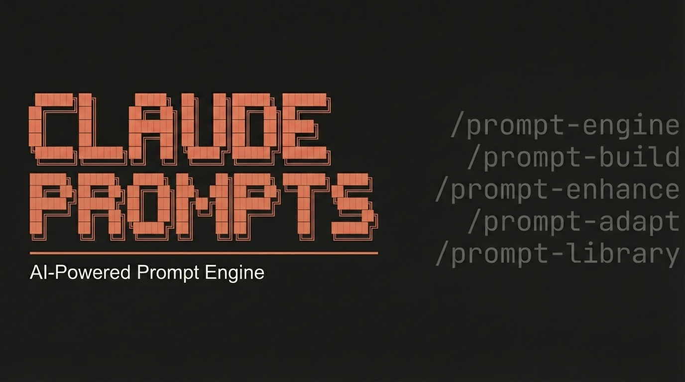

<p align="center">
  
</p>

# Claude Prompts

AI prompt database and builder skill for [Claude Code](https://docs.anthropic.com/en/docs/claude-code) with 2,500+ curated prompts across 19 categories and 17 AI models.

Search, build, enhance, and adapt prompts for Midjourney, Flux, Leonardo AI, DALL-E, Sora, Imagen, Mystic, Stable Diffusion, Ideogram, Adobe Firefly, Freepik, and more.

## Features

- **2,503 curated prompts** extracted from 11 Airtable sources
- **19 categories**: fashion-editorial, video, portraits, landscapes, sci-fi, architecture, logos, fantasy, and more
- **17 AI models**: Midjourney (981), Leonardo AI (237), Freepik (172), Mystic (166), Flux (137), and others
- **4 output types**: Video (1,225), Image (1,049), Generator (115), Text (114)
- **5 skill commands** for searching, building, enhancing, adapting, and browsing prompts

## Commands

| Command | What it does |
|---------|-------------|
| `/prompt [query]` | Search prompts by keyword, category, model, or style |
| `/prompt-build` | Build a custom prompt from scratch with guided workflow |
| `/prompt-enhance` | Enhance an existing prompt with pro techniques |
| `/prompt-adapt` | Adapt a prompt for a different AI model |
| `/prompt-library` | Browse, filter, and explore the full prompt library |

## Installation

### Requirements

- [Claude Code](https://docs.anthropic.com/en/docs/claude-code) CLI
- Python 3.10+

### Install (Linux / macOS)

```bash
git clone https://github.com/AgriciDaniel/claude-prompts.git
cd claude-prompts
bash install.sh
```

### Install (Windows / PowerShell)

```powershell
git clone https://github.com/AgriciDaniel/claude-prompts.git
cd claude-prompts
.\install.ps1
```

> **Note:** The prompt database (`prompts/all_prompts.json`) is ~5.4 MB. Total repository size is approximately 12 MB.

The install script:
1. Copies skill files to `~/.claude/skills/`
2. Substitutes path placeholders with your local repo path
3. Symlinks reference files (no duplication)
4. Verifies the prompt database and search script

### Verify

```bash
python3 scripts/search_prompts.py --stats
```

## Usage Examples

### Search for prompts
```bash
# In Claude Code, just type:
/prompt cyberpunk city

# Or use the search script directly:
python3 scripts/search_prompts.py "cyberpunk city" --limit 5
```

### Filter by model
```bash
/prompt --model Midjourney
python3 scripts/search_prompts.py --model "Midjourney" --limit 10
```

### Filter by category
```bash
/prompt --category fashion-editorial
python3 scripts/search_prompts.py --category fantasy --limit 10
```

### Get a random prompt
```bash
python3 scripts/search_prompts.py --random --model Flux
```

### Build a custom prompt
```
/prompt-build
# Follow the guided workflow: output type -> target model -> subject -> style
```

### Enhance an existing prompt
```
/prompt-enhance "A cat sitting on a windowsill"
# Scores your prompt, finds similar top prompts, applies enhancement techniques
```

### Adapt between models
```
/prompt-adapt
# Translates prompts between Midjourney, Flux, DALL-E, Sora, and other models
```

## Project Structure

```
claude-prompts/
  prompt-engine/              # Main orchestrator skill
    SKILL.md                  # Entry point with routing table
  skills/                     # Sub-skills
    prompt-build/SKILL.md     # Build custom prompts
    prompt-enhance/SKILL.md   # Enhance existing prompts
    prompt-adapt/SKILL.md     # Adapt between models
    prompt-library/SKILL.md   # Browse the library
  scripts/                    # Python scripts
    search_prompts.py         # Search and filter the database
    extract_prompts.py        # Extract prompts from raw Airtable data
    scrape_airtable.py        # Scrape Airtable shared views (template)
  references/                 # Knowledge files
    model-guide.md            # Model-specific syntax and best practices
    prompt-patterns.md        # Common prompt engineering patterns
  prompts/                    # Prompt database (JSON)
    all_prompts.json          # Master file (2,503 prompts)
    stats.json                # Database statistics
    {category}/prompts.json   # Per-category files (19 categories)
  install.sh                  # Installation script
```

## Categories

| Category | Count | Description |
|----------|-------|-------------|
| fashion-editorial | 473 | Fashion, editorial, magazine shoots |
| video-general | 287 | Video-specific prompts |
| general | 221 | Multi-purpose prompts |
| portraits-people | 198 | Faces, characters, headshots |
| landscapes-nature | 180 | Mountains, oceans, forests, sunsets |
| abstract-backgrounds | 171 | Gradients, patterns, wallpapers |
| sci-fi-futuristic | 135 | Cyberpunk, robots, space, neon |
| architecture | 129 | Buildings, interiors, cityscapes |
| logos-icons | 116 | Logo design, icon sets, branding |
| generators | 115 | Meta-prompts that create prompts |
| text | 114 | Copywriting, content, storytelling |
| animated-3d | 92 | Pixar, 3D renders, anime |
| vehicles | 82 | Cars, motorcycles, racing |
| superheroes | 58 | Marvel, DC, superhero art |
| fantasy | 56 | Dragons, magic, medieval, mythical |
| products | 42 | Product photography, packshots |
| animals | 18 | Wildlife, pets, creatures |
| food-drink | 11 | Food photography, recipes |
| print-merchandise | 5 | T-shirts, stickers, merch |

## Adding Your Own Prompts

The extraction pipeline supports Airtable shared views:

1. Add your Airtable shared view URLs to `scripts/scrape_airtable.py` (TABLES dict)
2. Install Playwright: `pip install playwright && playwright install chromium`
3. Run the scraper: `python3 scripts/scrape_airtable.py --output raw`
4. Extract and categorize: `python3 scripts/extract_prompts.py --input raw --output prompts`
5. Reinstall: `bash install.sh`

## Attribution & Disclaimer

The prompts in this database were collected from publicly shared Airtable views and community sources.
If you are the original creator of any prompt and would like it removed or credited differently,
please open an issue and we will address it promptly. This project is intended for educational
and creative purposes. Always respect the original creators' rights and terms of service.

## Support

- **Issues**: [GitHub Issues](https://github.com/AgriciDaniel/claude-prompts/issues)
- **Discussions**: [GitHub Discussions](https://github.com/AgriciDaniel/claude-prompts/discussions)
- **Contributing**: See [CONTRIBUTING.md](CONTRIBUTING.md)

## License

[MIT](LICENSE)
